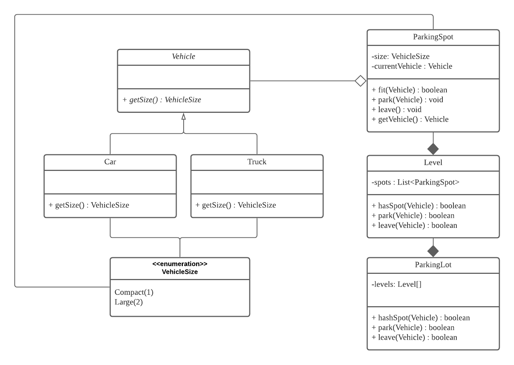

# Parking Lot OOD
Description: a project contains basic function of parking lot

## Functionality
* Basic funtionality: for a given vehicle, tell whether there is available spot in the parking lot
* Possible extensions: provide available spot locations: assign spot to the vehicle

## Assumptions:
1. multiple levels
2. Check vehicle size

## API
* boolean hasSpot(Vehicle v);
* boolean park(Vehicle v);
* boolean leave(Vehicle v);

## classes:
* ParkingLot, Level, Vehicle, ParkingSpot, Car, Truck

# UML

 
